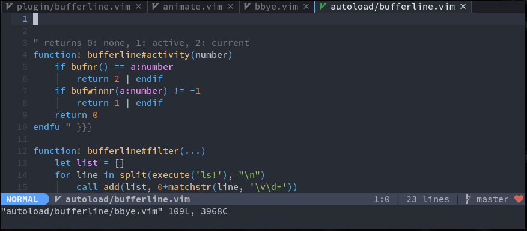

# barbar.nvim

> Tabs, as understood by any other editor.

`barbar.nvim` is a tabline plugin with re-orderable auto-sizing clickable tabs, icons,
nice highlighting, sort-by commands and a magic jump-to-buffer mode. Plus the tab
names are made unique when two filenames match.

In jump-to-buffer mode, tabs display a target letter instead of their icon. Jump to
any buffer by simply typing their target letter. Even better, the target letter
stays constant for the lifetime of the buffer, so if you're working with a set of
files you can even type the letter ahead from memory.

##### Table of content
 - [Features](#features)
 - [Install](#install)
 - [Usage](#usage)
 - [Options](#options)
 - [About Barbar](#about)

## Features

##### Move


##### Re-order tabs


##### Auto-sizing tabs, fill the space when available


##### Jump-to-buffer


Letters stay constant for the lifetime of the buffer. By default, letters are assigned
based on buffer name, eg **README** will get letter **r**. You can change this so that
letters are assigned based on usability: home row (`asdfjkl;gh`) first, then other rows.

##### Sort tabs automatically


`:BufferOrderByDirectory` and `:BufferOrderByLanguage`

##### Clickable & closable tabs


Left-click to go, middle-click or close button to close.

##### Unique names when filenames match


##### bbye.vim for closing buffers

A modified version of [bbye.vim](https://github.com/moll/vim-bbye) is included in this
plugin to close buffers without messing with your window layout and more. Available
as `BufferClose` and `bufferline#bbye#delete(buf)`.

##### Animations?

This is very experimental and not merged in master. You want this? Add a comment in
https://github.com/romgrk/barbar.nvim/pull/23 to convince me it's a good idea.



## Install

Is ~~two~~ one dependency a lot for one plugin? Yes it is. But is Barbar a very good
tabline plugin? Also yes. Do you now understand why the Install section is
strategically placed after the cool demos? Yes again.

```vim
Plug 'kyazdani42/nvim-web-devicons'
" Plug 'romgrk/lib.kom' -- removed! You can remove it from your vimrc
Plug 'romgrk/barbar.nvim'
```
You can skip the dependency on `'kyazdani42/nvim-web-devicons'` if you
[disable icons](#options).

I might remove the dependencies in the future if I have enough time to port the
required functions, or if you complain loud enough. 

##### Requirements
 - Neovim `0.5`

## Usage

### Mappings & commands

No default mappings are provided, here is an example. It is recommended to use
the `BufferClose` command to close buffers instead of `bdelete` because it will
not mess your window layout.

```vim
" Magic buffer-picking mode
nnoremap <silent> <C-s> :BufferPick<CR>
" Sort automatically by...
nnoremap <silent> <Space>bd :BufferOrderByDirectory<CR>
nnoremap <silent> <Space>bl :BufferOrderByLanguage<CR>
" Move to previous/next
nnoremap <silent>    <A-,> :BufferPrevious<CR>
nnoremap <silent>    <A-.> :BufferNext<CR>
" Re-order to previous/next
nnoremap <silent>    <A-<> :BufferMovePrevious<CR>
nnoremap <silent>    <A->> :BufferMoveNext<CR>
" Goto buffer in position...
nnoremap <silent>    <A-1> :BufferGoto 1<CR>
nnoremap <silent>    <A-2> :BufferGoto 2<CR>
nnoremap <silent>    <A-3> :BufferGoto 3<CR>
nnoremap <silent>    <A-4> :BufferGoto 4<CR>
nnoremap <silent>    <A-5> :BufferGoto 5<CR>
nnoremap <silent>    <A-6> :BufferGoto 6<CR>
nnoremap <silent>    <A-7> :BufferGoto 7<CR>
nnoremap <silent>    <A-8> :BufferGoto 8<CR>
nnoremap <silent>    <A-9> :BufferLast<CR>
" Close buffer
nnoremap <silent>    <A-c> :BufferClose<CR>
" Wipeout buffer
"                          :BufferWipeout<CR>
```

### Highlighting

For the highligh groups, here are the default ones:
```vim

let bg_current = get(nvim_get_hl_by_name('Normal',     1), 'background', '#000000')
let bg_visible = get(nvim_get_hl_by_name('TabLineSel', 1), 'background', '#000000')
let bg_inactive = get(nvim_get_hl_by_name('TabLine',   1), 'background', '#000000')

" For the current active buffer
hi default link BufferCurrent      Normal
" For the current active buffer when modified
hi default link BufferCurrentMod   Normal
" For the current active buffer icon
hi default link BufferCurrentSign  Normal
" For the current active buffer target when buffer-picking
exe 'hi default BufferCurrentTarget   guifg=red gui=bold guibg=' . bg_current

" For buffers visible but not the current one
hi default link BufferVisible      TabLineSel
hi default link BufferVisibleMod   TabLineSel
hi default link BufferVisibleSign  TabLineSel
exe 'hi default BufferVisibleTarget   guifg=red gui=bold guibg=' . bg_visible

" For buffers invisible buffers
hi default link BufferInactive     TabLine
hi default link BufferInactiveMod  TabLine
hi default link BufferInactiveSign TabLine
exe 'hi default BufferInactiveTarget   guifg=red gui=bold guibg=' . bg_inactive


" For the shadow in buffer-picking mode
hi default BufferShadow guifg=#000000 guibg=#000000
```

You can also use the [doom-one.vim](https://github.com/romgrk/doom-one.vim)
colorscheme that defines those groups and is also very pleasant as you could see
in the demos above.

## Options

NOTE: Until [#13167](https://github.com/neovim/neovim/pull/13167) is merged,
having too many tabline items shows as "E541" :/ If this happens a lot to you,
you can disable the options `clickable`, `closable`, or `icons` to reduce
the number of items you have.

```vim
let bufferline = {}

" Show a shadow over the editor in buffer-pick mode
let bufferline.shadow = v:true

" Enable/disable icons
let bufferline.icons = v:true

" Enable/disable close button
let bufferline.closable = v:true

" Enables/disable clickable tabs
"  - left-click: go to buffer
"  - middle-click: delete buffer
let bufferline.clickable = v:true

" If set, the letters for each buffer in buffer-pick mode will be
" assigned based on their name. Otherwise or in case all letters are
" already assigned, the behavior is to assign letters in order of
" usability (see order below)
let bufferline.semantic_letters = v:true

" New buffer letters are assigned in this order. This order is
" optimal for the qwerty keyboard layout but might need adjustement
" for other layouts.
let bufferline.letters = 
  \ 'asdfjkl;ghnmxcbziowerutyqpASDFJKLGHNMXCBZIOWERUTYQP'

" Sets the maximum padding width with which to surround each tab
let bufferline.maximum_padding = 4

```

## About

Barbar is called barbar because it's a bar, but it's also more than a bar:
a "barbar".

It is pronounced like "Jar Jar" in "Jar Jar Binks", but with Bs.

No, barbar has nothing to do with barbarians.

## License

barbar.nvim: Distributed under the terms of the JSON license.
bbye.vim: Distributed under the terms of the GNU Affero license.
